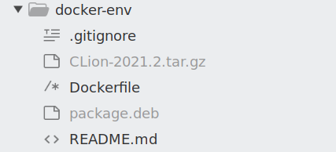
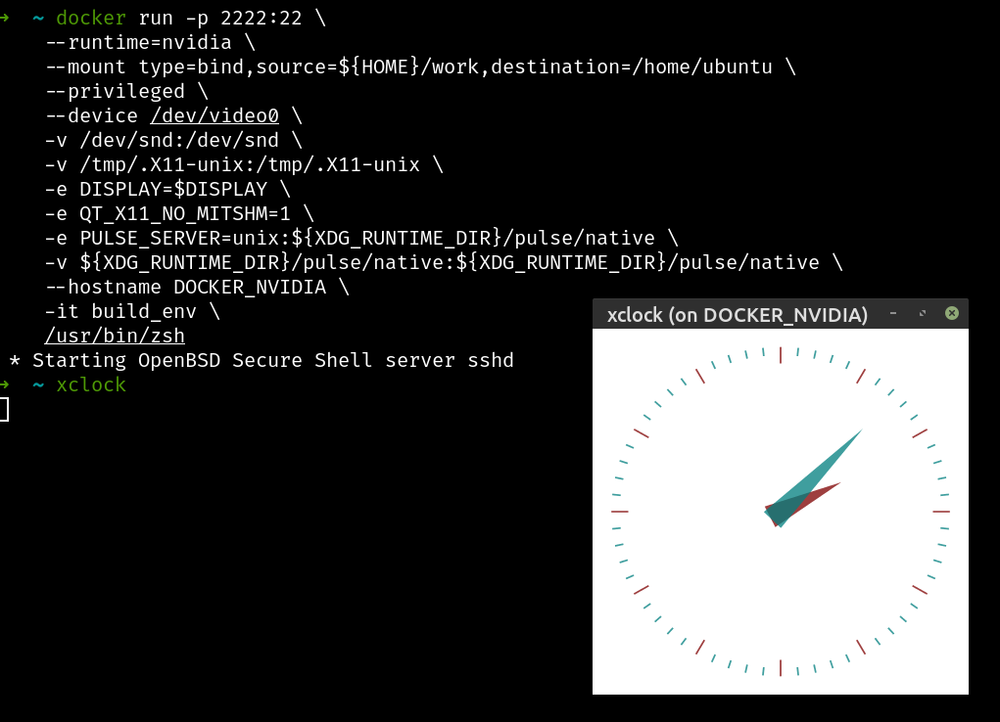
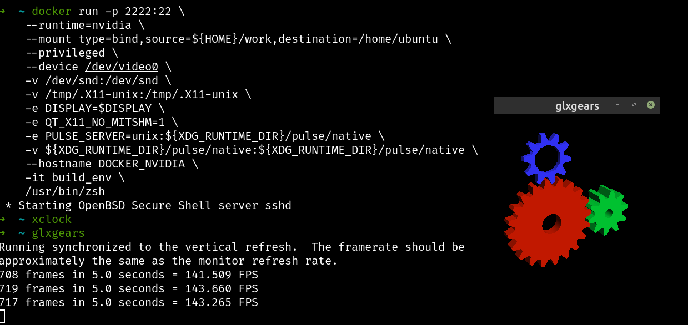
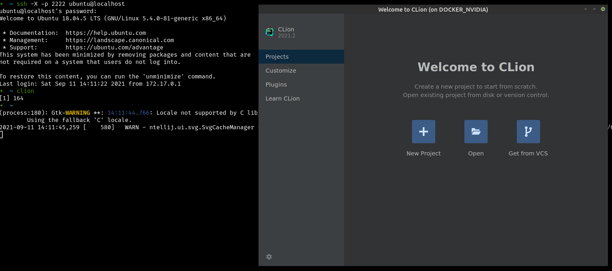

# Docker development environment based on NVIDIA docker image.

## pre-requirements
- Linux distributive on the host
- Installed NVIDIA drivers
- Installed docker
- Created ~/work folder for using as a home folder inside a docker container
- CLion tar.gz archive placed next to Dockerfile
- .deb package placed next to Dockerfile 



## docker build
```
docker build --build-arg UID=$(id -u) -t build_env .
```
This command creates user inside docker with the same user id. The host machine and docker container will not have files rights conflicts.

## docker run
```
docker run -p 2222:22 \
    --runtime=nvidia \
    --mount type=bind,source=${HOME}/work,destination=/home/ubuntu \
    --privileged \
    --device /dev/video0 \
    -v /dev/snd:/dev/snd \
    -v /tmp/.X11-unix:/tmp/.X11-unix \
    -e DISPLAY=$DISPLAY \
    -e QT_X11_NO_MITSHM=1 \
    -e PULSE_SERVER=unix:${XDG_RUNTIME_DIR}/pulse/native \
    -v ${XDG_RUNTIME_DIR}/pulse/native:${XDG_RUNTIME_DIR}/pulse/native \
    --hostname DOCKER_NVIDIA \
    -it build_env \
    /usr/bin/zsh
```
- Running container you will be able to use exposed ssh port 2222 using ubuntu:ubuntu credentials. 
- The option privileged is needed to bypass devices inside the contained and it can requite experimental feature on in docker config.
- /dev/video0 explicitly set in command line. If you have another one please set proper device.
- DOCKER_NVIDIA is the hostname. Please change on your favorite name if you want.
- zsh is used inside the container. Feel free to change favorite yours.
- ~/work directory is mapped to home directory inside the docker. The state of this dirrectory saves between start. You can feel it like real home folder.
- .deb package installs during docker container build. You can remove this step from Dockerfile if needed. The same is for CLion.
- This docker image based on Ubuntu 18.04 and there are several packages versions are outdated. That's why linuxbrew added to container to add fresh version for several packages.

Be aware that 3d based applications can be started from the docker container shell only. X applications can be started from the docker container shell and using ssh session.

## ssh access
```
ssh -X -p 2222 ubuntu@localhost
````

## examples of using

- X application started from docker container shell


- 3d application started from docker container shell


- X application (CLion) started from ssh session

